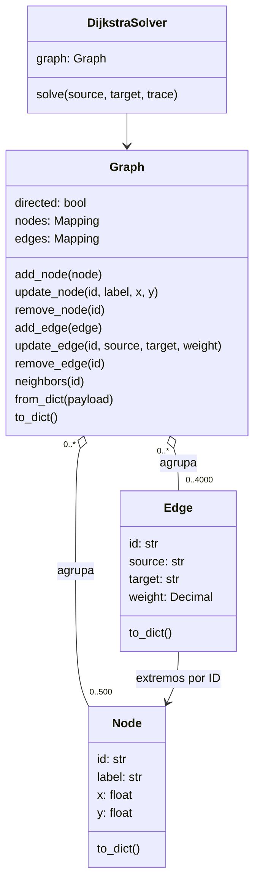

# API del núcleo Python

Python 3.10 o posterior. El núcleo utiliza únicamente la biblioteca estándar.

## Objetos y responsabilidades

| Clase | Atributos públicos | Responsabilidad |
|---|---|---|
| `Node` | `id`, `label`, `x`, `y` | Identidad, texto y posición visual de un nodo. Inmutable. |
| `Edge` | `id`, `source`, `target`, `weight` | Extremos y costo exacto `Decimal` de una conexión. Inmutable. |
| `Graph` | `directed`, `nodes`, `edges` | Pertenencia, edición y adyacencia. Rechaza cambios que rompen invariantes. |
| `DijkstraSolver` | `graph` | Ejecutar Dijkstra desde cero, reconstruir la ruta y registrar operaciones reales. |
| `ValidationError` | `args`, heredado de `ValueError`; texto con `str(error)` | Comunicar una entrada inválida en español. No define un atributo `message`. |

## Construcción y valores iniciales

| Constructor | Contrato |
|---|---|
| `Node(id, label="", x=0.0, y=0.0)` | Valida identidad, etiqueta y coordenadas. Conserva una etiqueta vacía o sus espacios; convierte coordenadas válidas a `float`. |
| `Edge(id, source, target, weight)` | Valida sus tres ID y convierte el peso a `Decimal` canónico. La existencia de los extremos se comprueba al añadirla a un `Graph`. |
| `Graph(directed=False)` | Crea colecciones vacías; exige un booleano exacto. Su orientación se consulta, pero no se modifica mediante una propiedad pública. |
| `DijkstraSolver(graph)` | Exige una instancia de `Graph` y conserva su referencia. Cada `solve` crea un estado de búsqueda nuevo. |
| `ValidationError(mensaje)` | Conserva el mensaje en los argumentos heredados. El proyecto lo comunica mediante `str(error)`. |



## Crear, editar y resolver

```python
from vertice import Node, Edge, Graph, DijkstraSolver

graph = Graph(directed=False)
graph.add_node(Node("A", "Inicio", 100, 150))
graph.add_node(Node("B", "Destino", 400, 150))
graph.add_edge(Edge("ab", "A", "B", "0.125"))
graph.update_edge("ab", weight="0.075")
result = DijkstraSolver(graph).solve("A", "B", trace=True)
assert result["path"] == ["A", "B"]
assert result["cost"] == "0.075"
```

`add_node(Node)` y `add_edge(Edge)` retornan el objeto insertado. `update_node(id, *, label, x, y)` y `update_edge(id, *, source, target, weight)` sustituyen el objeto después de validar todos los cambios; los argumentos omitidos conservan su valor. Los ID son estables y no se editan. Una modificación inválida conserva el grafo anterior.

`remove_node(id)` elimina también sus conexiones entrantes y salientes. `remove_edge(id)` elimina la conexión y ambas referencias de adyacencia en un grafo no dirigido. Ambos devuelven el objeto retirado. `get_node(id)` y `get_edge(id)` rechazan ID inexistentes. `nodes` y `edges` son vistas de solo lectura y sus elementos son inmutables.

`neighbors(id)` devuelve una tupla de pares `(id_vecino, Edge)` ordenada por ID. La adyacencia interna es `dict[id_nodo, dict[id_vecino, id_conexión]]`. Un grafo dirigido conserva únicamente referencias salientes; uno no dirigido conserva las dos orientaciones, excepto un bucle propio, que aparece una vez. No se admiten conexiones paralelas. La orientación se fija al crear el grafo.

`Graph.from_dict(payload)` importa y valida un grafo completo. `to_dict()` exporta un objeto independiente, ordenado por ID y serializable como JSON. Las coordenadas afectan solo a la presentación: no intervienen en el costo de una ruta.

La agregación del diagrama representa las colecciones administradas por cada grafo. No implica propiedad exclusiva del objeto Python: la API puede añadir la misma instancia inmutable de `Node` o `Edge` a varios grafos que cumplan sus invariantes. Cada grafo mantiene su propia adyacencia.

## Costos y límites

Los pesos aceptan texto decimal ordinario, enteros, `float` finitos o `Decimal`. Se recomienda texto para conservar exactamente lo escrito. Los `float` ya han pasado por la representación binaria del llamador; el núcleo convierte su representación textual, sin recuperar cifras que ese llamador haya perdido. El parser JSON lee enteros como `int` y números con fracción o exponente como `Decimal`, directamente desde el token original. `Edge` convierte ambos a un peso `Decimal` exacto dentro de los límites.

El intervalo permitido es `[0, 1000000000000]`, con hasta seis decimales significativos después del punto; los ceros finales no cuentan. Por ejemplo, `"1.23000000"` se guarda como `"1.23"`. No se redondea una entrada inválida. Los textos no admiten espacios, signo `+`, notación científica ni ceros iniciales ambiguos. JSON numérico sí admite su notación científica estándar cuando el valor cumple los límites. Booleanos, negativos, NaN e infinitos se rechazan.

Las sumas se ejecutan con un contexto decimal propio de precisión 40. Con 500 nodos, pesos máximos de `10^12` y seis decimales, toda distancia candidata cabe exactamente en esa precisión. Una modificación externa de la precisión, redondeo o trampas de `decimal` no altera el resultado.

IDs: 1–40 caracteres ASCII alfanuméricos, `_` o `-`. Etiquetas: hasta 80 puntos de código Unicode válidos, medidos con `len` en Python, sin caracteres de control. Un emoji compuesto puede usar varios puntos de código. Se permiten etiquetas vacías y espacios, que no se recortan. Coordenadas: números finitos entre −10000 y 10000. Máximo: 500 nodos, 4000 conexiones, JSON de 2 MiB y 100 caracteres por número de entrada. La API directa limita también a 100 los dígitos de un peso `Decimal`. Las claves desconocidas o duplicadas se rechazan.

Antes de decodificar el JSON se limita su estructura a 5000 objetos/arreglos en total y 50000 comas/dos puntos fuera de cadenas. Una solicitud válida con todos los campos, 500 nodos y 4000 conexiones ocupa 4504 contenedores y 36012 signos de puntuación; los límites permiten ese máximo. Comillas escapadas, puntuación y Unicode dentro de etiquetas conservan su significado. Esta protección reduce la amplificación de memoria de entradas inválidas; **2 MiB de entrada no equivalen a 2 MiB de RAM**.

## Resultado y trazas

`solve(source, target, trace=True)` devuelve el objeto del contrato compartido. `status="ok"` incluye `path`, `edge_path` y `cost` decimal como texto. `status="no_path"` devuelve ambas rutas vacías y `cost=null`. Inicio igual a destino tiene ruta de un nodo y costo `"0"`.

El algoritmo termina al asentar el destino. **Solo las distancias de los nodos en `settled` son definitivas.** Las demás pueden ser tentativas; `null` significa que todavía no se descubrió una ruta. Si la búsqueda agota la cola sin alcanzar el destino, no existe ruta desde el inicio.

La cola mínima guarda `(costo, id_nodo)`. Vecinos y desempates se ordenan por ID ASCII; una igualdad no sustituye al predecesor anterior. El resultado es reproducible al reordenar la entrada. Esto no promete la ruta lexicográficamente mínima global entre todas las rutas óptimas.

Las trazas contienen eventos `initialize`, `settle`, `consider`, `relax`, `stale` y `finish`. `step` es consecutivo desde cero. `consider.new_cost` es la distancia candidata; `relax` registra únicamente una mejora estricta aplicada. `stale` registra una entrada antigua descartada de la cola. `trace=False` produce una lista vacía sin cambiar la ruta ni las estadísticas.

`stats.settled` cuenta nodos asentados; `relaxations`, mejoras aplicadas; `heap_pushes`, inserciones incluida la inicial; `heap_pops`, extracciones; `stale_pops`, entradas descartadas. No se inventan tiempos ni se copia la cola completa en cada evento. El número de eventos es `O(V + E)`.

La búsqueda completa, incluidos el orden inicial de nodos, la cola con eliminación diferida y el orden de vecinos, tiene cota `O((V + E) log(V + E + 1))` y memoria `O(V + E)`. `Graph.neighbors` ordena al consultarse: su costo total está acotado por `O(E log(1 + V))` porque no se admiten conexiones paralelas. La lectura JSON, validación, construcción del grafo y serialización son fases adicionales; sus tiempos no forman parte de la medición `solver_only`. [El argumento detallado](ALGORITMO.md) mantiene separadas esas operaciones. No se utiliza NetworkX ni SciPy para resolver.

## JSON común a terminal, servidor y navegador

```python
from vertice.codec import solve_payload, solve_json

result = solve_payload({"graph": graph.to_dict(), "source": "A", "target": "B", "trace": True})
# solve_json recibe exclusivamente texto JSON y devuelve texto JSON.
```

Ambas funciones ejecutan la misma clase `DijkstraSolver`. Entradas inválidas generan `ValidationError`; no evalúan código del usuario. La carga rechaza constantes no finitas, claves repetidas, Unicode inválido y estructuras fuera de límites. La salida usa costos como texto y nunca NaN/Infinity. La adaptación HTTP decide el código de estado; el núcleo no oculta una excepción como una ruta vacía.

`load_json(text)` comprueba tipo, codificación UTF-8 y tamaño antes del límite estructural. Después utiliza `json.loads` con los conversores estrictos existentes; el escaneo previo no sustituye la validación sintáctica ni la del grafo. La ruta rápida sobreestima al contar también caracteres de las cadenas; solo cuando excede los umbrales recorre el texto y excluye su contenido. No se promete un límite independiente de profundidad ni de memoria de proceso.

El servidor local resuelve `/api/solve` mediante `solve_payload(load_json(text))`. `_json` serializa el resultado una sola vez y conserva los encabezados y errores HTTP existentes. La versión del navegador utiliza la copia del mismo núcleo, verificada por SHA-256.

## Terminal

```console
python -m vertice.cli create --output grafo.json
python -m vertice.cli edit grafo.json add-node A --label Inicio --x 100 --y 150 --output grafo.json --overwrite
python -m vertice.cli edit grafo.json add-node B --label Destino --x 400 --y 150 --output grafo.json --overwrite
python -m vertice.cli edit grafo.json add-edge ab --source A --target B --weight 0.125 --output grafo.json --overwrite
python -m vertice.cli validate grafo.json
python -m vertice.cli solve grafo.json --source A --target B --json --trace
```

`edit` también ofrece `update-node`, `remove-node`, `update-edge` y `remove-edge`. `create --directed` crea un grafo dirigido. La salida requiere `--overwrite` para reemplazar un archivo existente; la escritura usa un archivo temporal en el mismo directorio y una operación atómica. `solve -` y `validate -` leen de la entrada estándar. Un resultado sin ruta sale con código 0; un error de validación o de archivo sale con código 2 y mensaje en la salida de errores.

Pruebas propias: `python -m unittest discover -s tests -p test_core.py -v`. La verificación independiente utiliza archivos separados y un oráculo distinto de Dijkstra.
