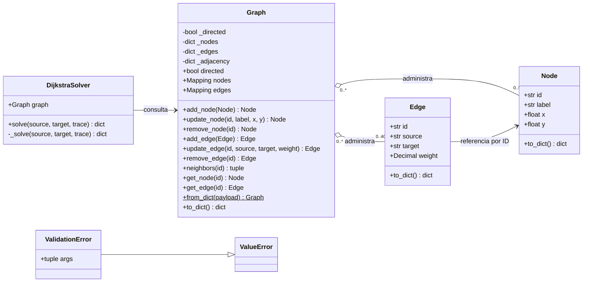
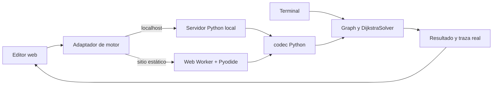

# Arquitectura de VÉRTICE / SDV

El sistema separa el grafo editable, la búsqueda de ruta y los medios para utilizarla. La terminal, el servidor local y el navegador llaman al mismo núcleo Python. La interfaz JavaScript dibuja el grafo y reproduce trazas; no reemplaza Dijkstra con otra implementación.

## Diagrama de clases

Los constructores, métodos, valores iniciales y tipos de resultado están en [API.md](API.md). [ALGORITMO.md](ALGORITMO.md) explica corrección, parada temprana y complejidad real. La agregación expresa pertenencia a las colecciones, sin imponer propiedad exclusiva: los valores inmutables pueden compartirse entre grafos. `ValidationError` hereda `args`; su mensaje se obtiene mediante `str(error)`, no mediante una propiedad `message`. [Python: argumentos de excepciones](https://docs.python.org/3.11/library/exceptions.html#BaseException.args).

## Responsabilidades y límites de cada módulo

| Módulo | Decide | No decide |
|---|---|---|
| `vertice/graph.py` | Identidades, extremos válidos, pesos, límites y edición atómica | Ruta mínima o apariencia de la página |
| `vertice/dijkstra.py` | Orden de expansión, relajaciones, costo y reconstrucción | Lectura de archivos, red o animaciones |
| `vertice/codec.py` | JSON estricto, límites previos a decodificar y contrato de entrada/salida | Código HTTP o mensajes visuales |
| `vertice/cli.py` | Argumentos, archivos, salida de terminal y códigos de proceso | Algoritmo distinto de búsqueda |
| `server.py` | Acceso loopback, peticiones y respuestas HTTP, archivos web y rangos de medios | Otra implementación de Dijkstra |
| `web/engine.js` | Elegir transporte local o worker y administrar solicitudes | Calcular caminos en JavaScript |
| `web/python-worker.js` | Cargar Python, comprobar el paquete y ejecutar el núcleo fuera del hilo visual | Editar el grafo mostrado |
| `web/app.js` | Edición, historial, selección, persistencia y reproducción de trazas | Afirmar que una distancia tentativa es definitiva |

## Por qué esta orientación a objetos

`Node` y `Edge` son objetos de valor pequeños. Una conexión conoce sus extremos mediante ID, por lo que no contiene referencias circulares ni copia nodos completos. El grafo administra la pertenencia y concentra reglas que un nodo aislado no podría verificar: extremos existentes, unicidad de conexiones y consistencia de adyacencia.

Las instancias de `Node` y `Edge` se declaran `frozen=True`: la edición pública habitual no cambia sus atributos. `Graph.nodes` y `Graph.edges` exponen `MappingProxyType`, una vista de solo lectura que sigue los cambios del diccionario administrado. Son medidas de encapsulación, no una frontera de seguridad frente a código Python que deliberadamente acceda a atributos privados. [Python: dataclasses inmutables](https://docs.python.org/3.11/library/dataclasses.html#frozen-instances); [Python: MappingProxyType](https://docs.python.org/3.11/library/types.html#types.MappingProxyType).

`DijkstraSolver` recibe un grafo y crea el estado de cada búsqueda dentro de `solve`. No conserva una ruta anterior ni modifica la topología. Por ello se puede resolver de nuevo después de editar el grafo sin limpiar resultados internos. No se introdujo una jerarquía de algoritmos, fábricas ni dependencias que el requisito no necesita.

El objeto `Graph` es mutable y **no promete edición concurrente entre hilos**. El contrato JSON crea un grafo propio para cada búsqueda; la interfaz envía una copia del estado y descarta respuestas asociadas a una revisión anterior.

## Invariantes de edición

1. Un ID identifica un solo nodo o conexión dentro de su colección. Los ID no se renombran durante una edición.
2. Toda conexión referencia nodos presentes. Eliminar un nodo elimina sus conexiones entrantes y salientes.
3. Solo existe una conexión por par ordenado en dirigido, o por par no ordenado en no dirigido.
4. La adyacencia coincide con la colección de conexiones. Un bucle propio ocupa una entrada.
5. Pesos, etiquetas y coordenadas permanecen dentro de sus límites. Una edición inválida no altera el objeto anterior.

`update_edge` construye y valida el reemplazo antes de retirar la conexión anterior. `update_node` sigue la misma estrategia. La importación crea un grafo nuevo y solo lo devuelve si todos sus componentes son válidos; el llamador conserva el estado visible anterior si la validación falla.

## Dos formas de ejecutar el mismo núcleo

En localhost, el adaptador verifica la identidad de `/api/health` antes de utilizar la API. El modo publicado ejecuta el paquete Python con Pyodide en un worker. El navegador solicita un manifiesto de cuatro archivos y comprueba SHA-256 antes de cargarlos; esto detecta archivos alterados respecto al manifiesto o mezclas de versiones durante una publicación. No sustituye una firma del editor ni una revisión del servidor que entrega el manifiesto.

Las consultas del worker pasan datos como argumento a `solve_json`; la importación usa un ayudante fijo que llama a `load_json` y `Graph.from_dict`. No se interpolan datos como código Python. La API local usa `solve_payload(load_json(text))` y serializa la respuesta una sola vez. La terminal guarda de forma atómica y exige `--overwrite` para reemplazar un archivo existente.

La importación utiliza `normalizeGraphJSON(texto)`: el adaptador entrega el texto original al validador Python, mediante HTTP o el worker. Se conserva así el lexema de los números y se pueden detectar claves repetidas antes de que un `JSON.parse` de JavaScript pierda esa información. El grafo normalizado regresa con pesos como texto decimal.

## Solicitudes, cancelación y versiones del grafo

El adaptador toma una copia de la solicitud antes de esperar y utiliza una cola FIFO con una operación activa. Cancelar una operación en espera la rechaza inmediatamente y no interrumpe la operación activa. Cancelar la operación activa del navegador termina su worker; la siguiente solicitud crea uno nuevo. Cancelar una operación HTTP aborta su petición. Los callbacks de un worker anterior se ignoran mediante identidad de instancia.

Abortar la petición HTTP deja de esperar o recibir su respuesta; no interrumpe por sí mismo un cálculo Python que el servidor ya comenzó. El servidor crea un grafo independiente para esa petición y la interfaz impide aplicar su respuesta si quedó obsoleta.

Cancelar una operación y comprobar si su resultado todavía corresponde al grafo son responsabilidades distintas: la cancelación libera o abandona trabajo, mientras que el identificador de revisión impide pintar resultados antiguos. Un error de carga permite reintentar, y un error de validación conserva el runtime que ya se cargó correctamente.

`tests/engine_queue.mjs` comprueba estos contratos importando el módulo real con Worker y fetch controlados en Node. Incluye cancelación antes de solicitar, durante carga, en espera, en ejecución y en HTTP; mensajes tardíos; orden FIFO; copias; reintentos y texto de importación. Estos controles no sustituyen la ejecución real de WebAssembly, la paridad con CPython o la revisión visual en un navegador.

## Alcance de la auditoría

Las pruebas propias cubren costos decimales, contexto decimal externo, ausencia de ruta, ciclos de costo cero, empates, trazas, edición atómica, Unicode, JSON hostil y operaciones de terminal. Las pruebas independientes utilizan un oráculo separado y están fuera del módulo del algoritmo. La verificación de transporte debe comparar resultados de CPython y Python del navegador con los mismos casos, y revisar cancelación, reintento y carga del paquete.

No se atribuye compatibilidad de todos los navegadores, hardware de vehículo ni operación sin conexión a partir de una prueba unitaria del núcleo. Cada una requiere evidencia propia. Los documentos de verificación registran qué entorno y comportamientos se ejecutaron realmente.

Fuentes primarias de Python consultadas el 12 de septiembre de 2026 UTC. Este documento describe decisiones de la implementación entregada; no es una certificación de seguridad.
